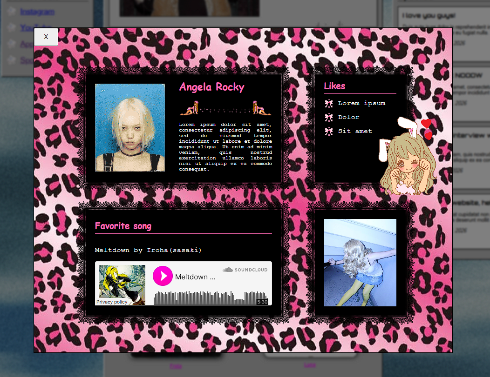
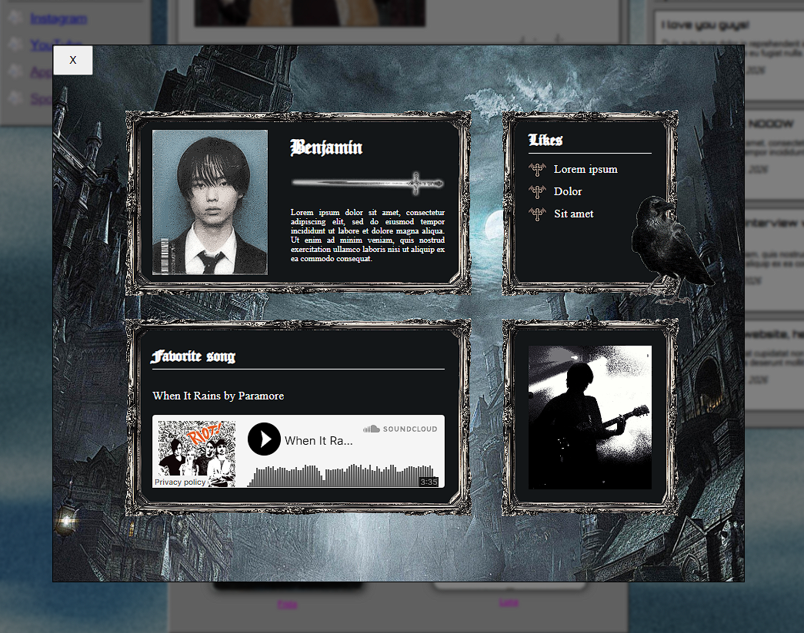
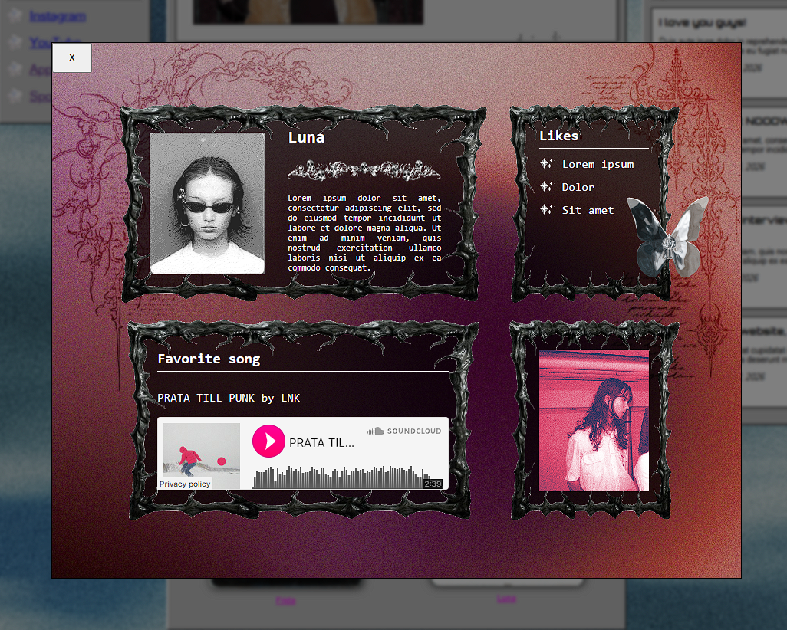

# Mångatan ✮ ⋆ ˚｡𖦹 ⋆｡°✩

🔗 **Live site:** https://mangatan.vercel.app/

Mångatan is a web application built with SvelteKit, featuring a Windows 98-inspired design. The app showcases information about the ⋆AMAZING⋆ band **Mångatan**, including news, upcoming gigs, and a merch shop, all wrapped in a visually nostalgic experience.

This project was developed as a final school exam project to demonstrate a full-stack, interactive web application, with the band serving as my first real client!

### ⋆ Features

- Band information with interactive member profiles
- News and upcoming gigs with a responsive layout
- Merch shop with sorting, filtering, and a persistent shopping cart
- Windows 98–inspired UI and visual style

## ✩ Screenshots

#### ⋆ Start Page


#### ⋆ About Page


#### ⋆ Merch Shop


<details>
  <summary>Member Profiles</summary>
  <div style="display: flex; gap: 10px; flex-wrap: wrap;">
  
  </div>
  <div style="display: flex; gap: 10px; flex-wrap: wrap;">
    
  </div>
  <div style="display: flex; gap: 10px; flex-wrap: wrap;">
    
  </div>
  <div style="display: flex; gap: 10px; flex-wrap: wrap;">
    
  </div>
</details>

## ✩ Install & Run

```bash
# Copy the example to a real .env file
cp .env.example .env

# Fill in your credentials
# For example, set MONGODB_URI to your MongoDB Atlas URI

# Install dependencies
npm install

# Start the app
npm run dev
```

## ✩ Tech Stack

#### ⋆ Framework


#### ⋆ Language & Styling


#### ⋆ Dev & Tools


#### ⋆ Backend


#### ⋆ Testing


## ✩ Authors

- [Jennifer Nilsson](https://www.github.com/ynnxj)
